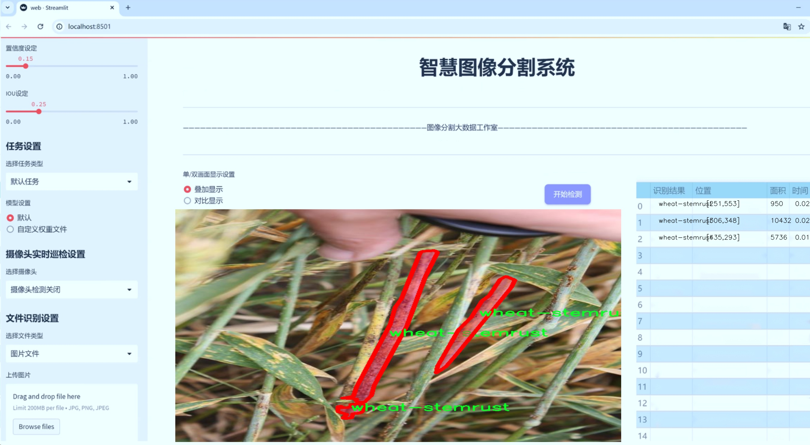
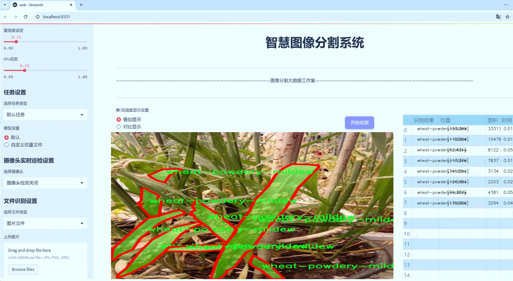
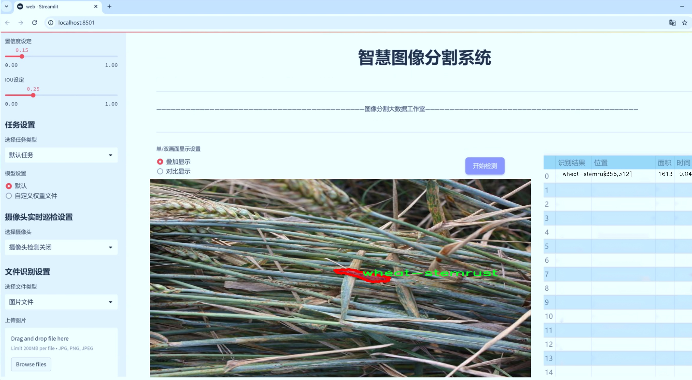
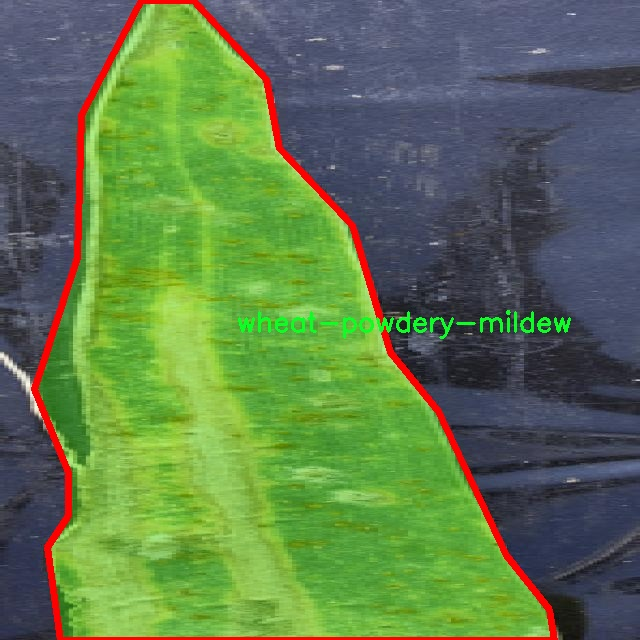
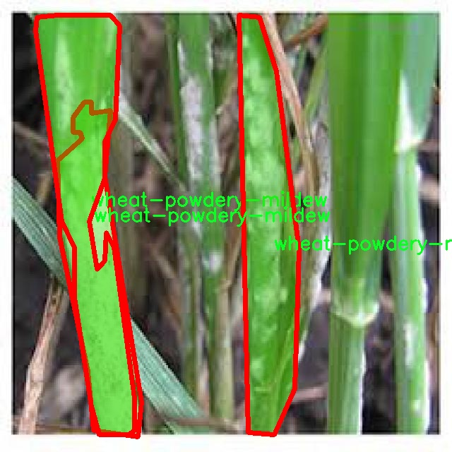
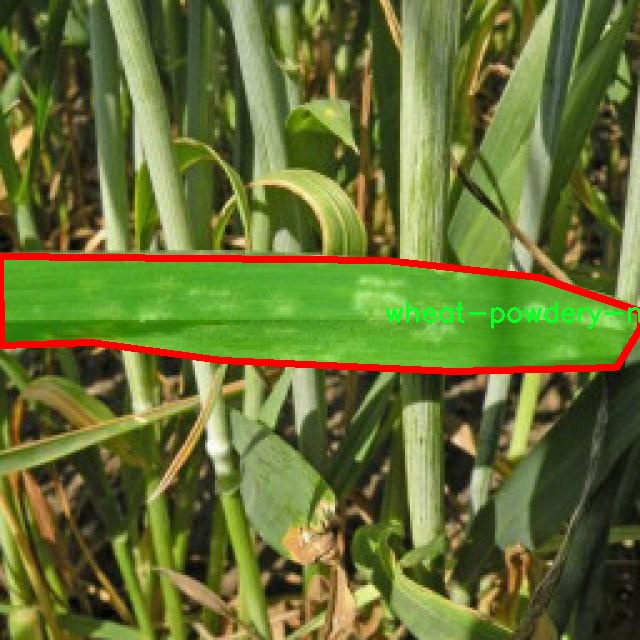
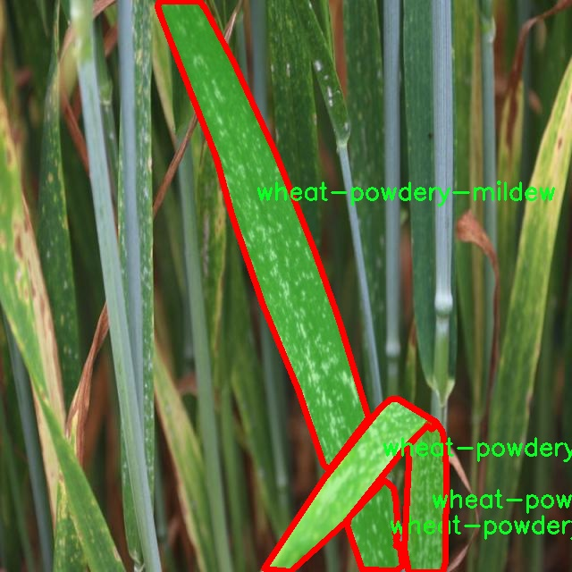
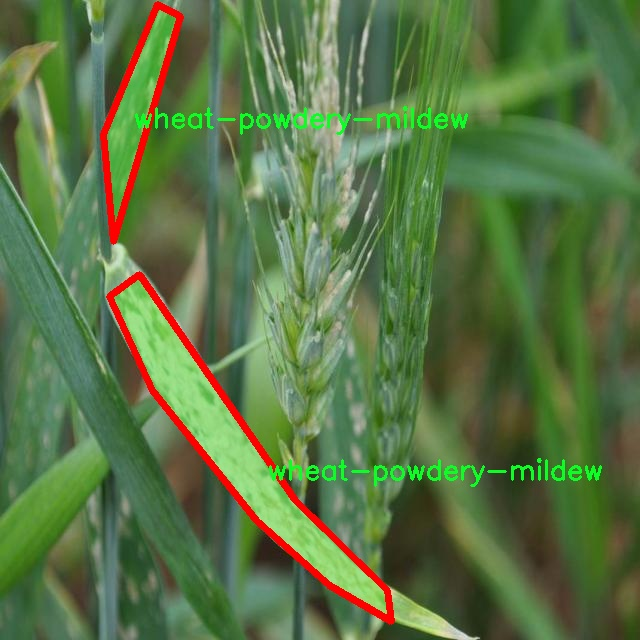
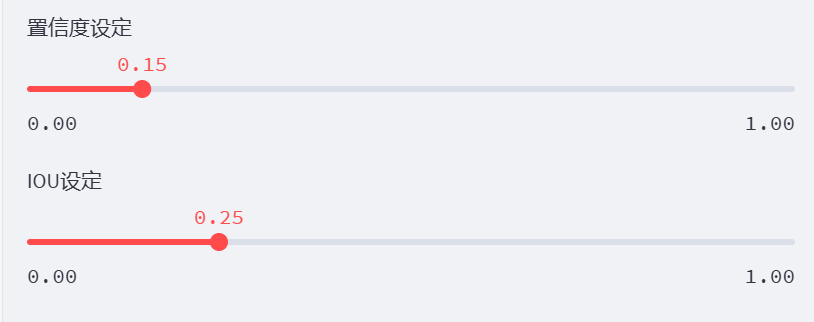

# 小麦病害分割系统： yolov8-seg-dyhead

### 1.研究背景与意义

[参考博客](https://gitee.com/YOLOv8_YOLOv11_Segmentation_Studio/projects)

[博客来源](https://kdocs.cn/l/cszuIiCKVNis)

研究背景与意义

随着全球人口的不断增长，粮食安全问题日益凸显。小麦作为全球主要的粮食作物之一，其产量和质量直接影响到人类的生存与发展。然而，小麦在生长过程中常常受到多种病害的侵袭，严重影响了小麦的产量和品质，进而对农业生产和经济发展造成了巨大的压力。根据相关研究，全球小麦病害造成的损失每年高达数十亿美元，因此，及时、准确地识别和分割小麦病害对于保障粮食安全具有重要的现实意义。

近年来，计算机视觉技术的迅猛发展为农业病害监测提供了新的解决方案。尤其是深度学习技术的应用，使得图像识别和分割的精度大幅提升。YOLO（You Only Look Once）系列模型作为一种高效的目标检测算法，因其快速、准确的特性，广泛应用于各类图像处理任务中。YOLOv8作为该系列的最新版本，进一步提升了模型的性能和适用性，特别是在实例分割任务中表现出色。通过对YOLOv8的改进，可以更好地适应小麦病害的特征，从而实现高效的病害检测与分割。

本研究旨在基于改进的YOLOv8模型，构建一个小麦病害分割系统。该系统将利用一个包含1900张图像的数据集，涵盖了四种主要的小麦病害类别：小麦白粉病、小麦叶斑病、小麦茎锈病和小麦黄锈病。这些病害在不同的生长阶段对小麦的影响各异，具有明显的视觉特征。通过对这些病害的准确分割与识别，农民和农业管理者可以更好地进行病害监测与管理，从而采取相应的防治措施，减少病害对小麦产量的影响。

在数据集的构建过程中，研究团队对每种病害进行了详尽的标注和分类，以确保模型训练的有效性和准确性。数据集的多样性和丰富性为模型的学习提供了良好的基础，使得模型能够在实际应用中具备更强的泛化能力。此外，改进YOLOv8模型的引入，将通过优化网络结构和调整超参数，提升模型在小麦病害分割任务中的表现，从而为农业领域的智能化发展提供技术支持。

综上所述，本研究不仅具有重要的理论价值，也具备显著的实践意义。通过构建基于改进YOLOv8的小麦病害分割系统，能够为小麦病害的快速识别与精准管理提供有效工具，助力农业生产的可持续发展。随着技术的不断进步，未来的农业将更加依赖于智能化手段，而本研究的成果将为这一进程提供重要的支撑。

### 2.图片演示







注意：本项目提供完整的训练源码数据集和训练教程,由于此博客编辑较早,暂不提供权重文件（best.pt）,需要按照6.训练教程进行训练后实现上图效果。

### 3.视频演示

[3.1 视频演示](https://www.bilibili.com/video/BV1ceUoYoERb/)

### 4.数据集信息

##### 4.1 数据集类别数＆类别名

nc: 4
names: ['wheat-powdery-mildew', 'wheat-septoria', 'wheat-stemrust', 'wheat-yellowrust']


##### 4.2 数据集信息简介

数据集信息展示

在现代农业生产中，小麦作为一种重要的粮食作物，其健康状况直接影响到粮食安全和农民的经济收益。为了有效监测和管理小麦病害，开发了一种基于YOLOv8-seg的改进小麦病害分割系统。该系统的训练依赖于一个名为“Wheat-desease”的数据集，该数据集专门用于小麦病害的识别与分割，旨在提高病害检测的准确性和效率。

“Wheat-desease”数据集包含四个主要类别，分别是小麦白粉病（wheat-powdery-mildew）、小麦叶斑病（wheat-septoria）、小麦茎锈病（wheat-stemrust）和小麦黄锈病（wheat-yellowrust）。这些病害在小麦生长过程中常常造成严重的损失，因此对其进行及时的识别和处理显得尤为重要。数据集中每个类别的样本数量经过精心设计，以确保模型在训练过程中能够获得足够的代表性数据，从而提升其泛化能力。

在数据集的构建过程中，研究团队收集了大量真实场景下的小麦病害图像。这些图像不仅涵盖了不同生长阶段的小麦植株，还考虑了不同环境条件下的表现。通过多样化的样本，数据集能够有效地反映出小麦病害的多样性和复杂性。此外，为了增强模型的鲁棒性，数据集中还包含了不同光照、角度和背景下的图像，确保模型在实际应用中能够适应各种变化。

每个类别的图像都经过精确的标注，标注信息包括病害的具体位置和形态特征。这些标注不仅为模型提供了训练所需的监督信号，还为后续的模型评估和优化提供了重要依据。通过精细的标注，研究人员能够深入分析模型在不同病害类别上的表现，从而针对性地进行改进。

在训练过程中，YOLOv8-seg模型将利用“Wheat-desease”数据集进行特征学习。该模型以其高效的实时检测能力和优越的分割性能，能够在小麦病害识别中发挥重要作用。通过对数据集的深度学习，模型将逐步掌握不同病害的特征，从而实现对小麦病害的精准分割和识别。

此外，数据集的构建和使用还为后续的研究提供了良好的基础。随着技术的不断进步，未来可以在此基础上扩展数据集，增加更多的病害类别和样本，从而进一步提升模型的性能和适用范围。通过不断优化和迭代，研究团队希望能够开发出更为高效的小麦病害监测系统，为农业生产提供强有力的技术支持。

总之，“Wheat-desease”数据集不仅是改进YOLOv8-seg小麦病害分割系统的核心组成部分，更是推动小麦病害检测技术发展的重要资源。通过对该数据集的深入研究和应用，研究人员期待能够为小麦病害的早期发现和精准管理提供切实可行的解决方案，进而促进农业的可持续发展。











### 5.项目依赖环境部署教程（零基础手把手教学）

[5.1 环境部署教程链接（零基础手把手教学）](https://www.bilibili.com/video/BV1jG4Ve4E9t/?vd_source=bc9aec86d164b67a7004b996143742dc)


[5.2 安装Python虚拟环境创建和依赖库安装视频教程链接（零基础手把手教学）](https://www.bilibili.com/video/BV1nA4VeYEze/?vd_source=bc9aec86d164b67a7004b996143742dc)

### 6.手把手YOLOV8-seg训练视频教程（零基础手把手教学）

[6.1 手把手YOLOV8-seg训练视频教程（零基础小白有手就能学会）](https://www.bilibili.com/video/BV1cA4VeYETe/?vd_source=bc9aec86d164b67a7004b996143742dc)


按照上面的训练视频教程链接加载项目提供的数据集，运行train.py即可开始训练



     Epoch   gpu_mem       box       obj       cls    labels  img_size
     1/200     0G   0.01576   0.01955  0.007536        22      1280: 100%|██████████| 849/849 [14:42<00:00,  1.04s/it]
               Class     Images     Labels          P          R     mAP@.5 mAP@.5:.95: 100%|██████████| 213/213 [01:14<00:00,  2.87it/s]
                 all       3395      17314      0.994      0.957      0.0957      0.0843

     Epoch   gpu_mem       box       obj       cls    labels  img_size
     2/200     0G   0.01578   0.01923  0.007006        22      1280: 100%|██████████| 849/849 [14:44<00:00,  1.04s/it]
               Class     Images     Labels          P          R     mAP@.5 mAP@.5:.95: 100%|██████████| 213/213 [01:12<00:00,  2.95it/s]
                 all       3395      17314      0.996      0.956      0.0957      0.0845

     Epoch   gpu_mem       box       obj       cls    labels  img_size
     3/200     0G   0.01561    0.0191  0.006895        27      1280: 100%|██████████| 849/849 [10:56<00:00,  1.29it/s]
               Class     Images     Labels          P          R     mAP@.5 mAP@.5:.95: 100%|███████   | 187/213 [00:52<00:00,  4.04it/s]
                 all       3395      17314      0.996      0.957      0.0957      0.0845


### 7.50+种全套YOLOV8-seg创新点加载调参实验视频教程（一键加载写好的改进模型的配置文件）

[7.1 50+种全套YOLOV8-seg创新点加载调参实验视频教程（一键加载写好的改进模型的配置文件）](https://www.bilibili.com/video/BV1Hw4VePEXv/?vd_source=bc9aec86d164b67a7004b996143742dc)

### YOLOV8-seg算法简介

原始YOLOv8-seg算法原理

YOLOv8-seg算法是Ultralytics公司在2023年推出的最新版本，标志着YOLO系列目标检测算法的又一次重大飞跃。相较于之前的版本，YOLOv8-seg不仅在目标检测方面表现出色，还在图像分割任务中展现了强大的能力。这一版本的设计理念是将快速、准确和易用性结合在一起，使其成为多种计算机视觉任务的理想选择。

YOLOv8-seg的网络结构以其独特的模块化设计为基础，首先在输入层，YOLOv8采用了640x640的默认输入尺寸，但为了适应不同长宽比的图像，算法引入了自适应图片缩放策略。这种策略通过将图像的长边缩放到指定尺寸，并对短边进行填充，显著减少了信息冗余，提高了目标检测和推理的速度。此外，在训练过程中，YOLOv8-seg利用Mosaic增强技术，通过随机组合四张图像，创造出新的训练样本，从而增强模型对不同位置和周围像素的学习能力。这种增强方法不仅提高了模型的预测精度，还提升了其整体性能。

在主干网络部分，YOLOv8-seg借鉴了YOLOv7中的ELAN模块设计思想，将YOLOv5中的C3模块替换为C2F模块。C2F模块通过并行更多的梯度流分支，丰富了特征提取过程中的信息流动，使得模型在保持轻量化的同时，能够获得更高的精度和更合理的延迟。这种设计使得YOLOv8-seg在特征提取时能够更加灵活地处理不同尺度的目标，提升了其在复杂场景下的表现。

在特征融合方面，YOLOv8-seg依然采用了FPN（特征金字塔网络）和PAN（路径聚合网络）的结构，以充分融合多尺度信息。通过这种结构，模型能够有效地整合来自不同层次的特征，从而增强对目标的识别能力。此外，YOLOv8-seg在Neck部分的设计上进行了优化，去除了冗余的卷积层，直接对Backbone不同阶段输出的特征进行上采样，这一改进进一步提升了模型的计算效率。

YOLOv8-seg的Head部分是其创新的关键所在。与之前版本的Coupled-Head结构不同，YOLOv8-seg采用了Decoupled-Head结构，将检测和分类任务分开处理。输入特征图首先通过两个1x1卷积模块进行降维，然后分别进行类别预测和边界框位置预测。这种解耦设计使得模型在处理复杂场景时能够更好地聚焦于不同任务的特征，提高了整体的检测精度。

值得注意的是，YOLOv8-seg摒弃了传统的Anchor-Based方法，转而采用Anchor-Free的策略。这一转变使得目标检测不再依赖于预设的锚框，而是将目标检测问题转化为关键点检测。这种方法不仅简化了模型的结构，还增强了其泛化能力，使得YOLOv8-seg能够更灵活地适应不同的数据集和场景。

在损失函数的设计上，YOLOv8-seg引入了新的标签分配策略，采用了TOOD（Targeted Object Detection）策略，旨在动态分配正负样本。这一策略通过优化类别损失和位置损失的计算，提升了模型对高质量样本的关注度，从而进一步提高了检测精度。具体而言，YOLOv8-seg的分类损失采用了Varifocal Loss（VFL），而回归损失则结合了CIoULoss和DFLLoss。这种损失函数的设计使得模型在训练过程中能够快速聚焦于标签附近的区域，提高了预测的准确性。

总的来说，YOLOv8-seg算法在多个方面进行了创新和优化，特别是在网络结构、特征融合、损失函数设计等方面的改进，使其在目标检测和图像分割任务中都展现出了卓越的性能。随着YOLOv8-seg的推出，计算机视觉领域的研究者和工程师们将能够更高效地解决各种复杂的视觉任务，推动相关应用的发展。无论是在智能监控、自动驾驶还是医疗影像分析等领域，YOLOv8-seg都将成为一个强有力的工具，为实现更高的检测精度和更快的处理速度提供了有力支持。


### 9.系统功能展示（检测对象为举例，实际内容以本项目数据集为准）

图9.1.系统支持检测结果表格显示

  图9.2.系统支持置信度和IOU阈值手动调节

  图9.3.系统支持自定义加载权重文件best.pt(需要你通过步骤5中训练获得)

  图9.4.系统支持摄像头实时识别

  图9.5.系统支持图片识别

  图9.6.系统支持视频识别

  图9.7.系统支持识别结果文件自动保存

  图9.8.系统支持Excel导出检测结果数据





### 10.50+种全套YOLOV8-seg创新点原理讲解（非科班也可以轻松写刊发刊，V11版本正在科研待更新）

#### 10.1 由于篇幅限制，每个创新点的具体原理讲解就不一一展开，具体见下列网址中的创新点对应子项目的技术原理博客网址【Blog】：


[10.1 50+种全套YOLOV8-seg创新点原理讲解链接](https://gitee.com/qunmasj/good)

#### 10.2 部分改进模块原理讲解(完整的改进原理见上图和技术博客链接)【如果此小节的图加载失败可以通过CSDN或者Github搜索该博客的标题访问原始博客，原始博客图片显示正常】
### YOLOv8简介
YOLO（You Only Look Once）是一种流行的对象检测和图像分割模型，由华盛顿大学的Joseph Redmon和Ali Farhadi开发。YOLO于2015年推出，以其高速度和高精度迅速走红。

YOLOv2于2016年发布，通过合并批处理规范化、锚盒和维度集群来改进原始模型
2018年推出的YOLOv3使用更高效的骨干网络、多个锚点和空间金字塔池进一步增强了该模型的性能
YOLOv4于2020年发布，引入了Mosaic数据增强、新的无锚检测头和新的丢失功能等创新
YOLOv5进一步提高了模型的性能，并添加了超参数优化、集成实验跟踪和自动导出到流行导出格式等新功能
YOLOv6于2022年由美团开源，目前正在该公司的许多自动配送机器人中使用
YOLOv7在COCO关键点数据集上添加了额外的任务，如姿态估计
YOLOv8是Ultralytics公司推出的YOLO的最新版本。作为一款尖端、最先进的（SOTA）车型，YOLOv8在之前版本的成功基础上，引入了新的功能和改进，以增强性能、灵活性和效率。YOLOv8支持全方位的视觉AI任务，包括检测、分割、姿态估计、跟踪和分类。这种多功能性允许用户在不同的应用程序和域中利用YOLOv8的功能
#### YOLOv8的新特性与可用模型

Ultralytics 并没有直接将开源库命名为 YOLOv8，而是直接使用 ultralytics 这个词，原因是 ultralytics 将这个库定位为算法框架，而非某一个特定算法，一个主要特点是可扩展性。其希望这个库不仅仅能够用于 YOLO 系列模型，而是能够支持非 YOLO 模型以及分类分割姿态估计等各类任务。总而言之，ultralytics 开源库的两个主要优点是：

融合众多当前 SOTA 技术于一体
未来将支持其他 YOLO 系列以及 YOLO 之外的更多算法
Ultralytics为YOLO模型发布了一个全新的存储库。它被构建为 用于训练对象检测、实例分割和图像分类模型的统一框架。

提供了一个全新的 SOTA 模型，包括 P5 640 和 P6 1280 分辨率的目标检测网络和基于 YOLACT 的实例分割模型。和 YOLOv5 一样，基于缩放系数也提供了 N/S/M/L/X 尺度的不同大小模型，用于满足不同场景需求
骨干网络和 Neck 部分可能参考了 YOLOv7 ELAN 设计思想，将 YOLOv5 的 C3 结构换成了梯度流更丰富的 C2f 结构，并对不同尺度模型调整了不同的通道数，属于对模型结构精心微调，不再是无脑一套参数应用所有模型，大幅提升了模型性能。不过这个 C2f 模块中存在 Split 等操作对特定硬件部署没有之前那么友好了
Head 部分相比 YOLOv5 改动较大，换成了目前主流的解耦头结构，将分类和检测头分离，同时也从 Anchor-Based 换成了 Anchor-Free
Loss 计算方面采用了 TaskAlignedAssigner 正样本分配策略，并引入了 Distribution Focal Loss
训练的数据增强部分引入了 YOLOX 中的最后 10 epoch 关闭 Mosiac 增强的操作，可以有效地提升精度
YOLOv8 还高效灵活地支持多种导出格式，并且该模型可以在 CPU 和 GPU 上运行。YOLOv8 模型的每个类别中有五个模型用于检测、分割和分类。YOLOv8 Nano 是最快和最小的，而 YOLOv8 Extra Large (YOLOv8x) 是其中最准确但最慢的。


### FocalModulation模型的基本原理
参考该博客，Focal Modulation Networks（FocalNets）的基本原理是替换自注意力（Self-Attention）模块，使用焦点调制（focal modulation）机制来捕捉图像中的长距离依赖和上下文信息。下图是自注意力和焦点调制两种方法的对比。


自注意力要求对每个查询令牌（Query Token）与其他令牌进行复杂的查询-键（Query-Key）交互和查询-值（Query-Value）聚合，以计算注意力分数并捕捉上下文。而焦点调制则先将空间上下文以不同粒度聚合到调制器中，然后以查询依赖的方式将这些调制器注入到查询令牌中。焦点调制简化了交互和聚合操作，使其更轻量级。在图中，自注意力部分使用红色虚线表示查询-键交互和黄色虚线表示查询-值聚合，而焦点调制部分则用蓝色表示调制器聚合和黄色表示查询-调制器交互。 

FocalModulation模型通过以下步骤实现：

1. 焦点上下文化：用深度卷积层堆叠来编码不同范围的视觉上下文。


2. 门控聚合：通过门控机制，选择性地将上下文信息聚合到每个查询令牌的调制器中。


3. 逐元素仿射变换：将聚合后的调制器通过仿射变换注入到每个查询令牌中。

下面来分别介绍这三个机制->

#### 焦点上下文化
焦点上下文化（Focal Contextualization）是焦点调制（Focal Modulation）的一个组成部分。焦点上下文化使用一系列深度卷积层（depth-wise convolutional layers）来编码不同范围内的视觉上下文信息。这些层可以捕捉从近处到远处的视觉特征，从而允许网络在不同层次上理解图像内容。通过这种方式，网络能够在聚合上下文信息时保持对局部细节的敏感性，并增强对全局结构的认识。


​

这张图详细比较了自注意力（Self-Attention, SA）和焦点调制（Focal Modulation）的机制，并特别展示了焦点调制中的上下文聚合过程。左侧的图展示了自注意力模型如何通过键（k）和查询（q）之间的交互，以及随后的聚合来生成输出。而中间和右侧的图说明了焦点调制如何通过层级化的上下文聚合和门控聚合过程替代自注意力模型的这一过程。在焦点调制中，输入首先通过轻量级线性层进行处理，然后通过层级化的上下文化模块和门控机制来选择性地聚合信息，最终通过调制器与查询（q）进行交互以生成输出。

#### 门控聚合
在Focal Modulation Networks（FocalNets）中的 "门控聚合"（Gated Aggregation）是关键组件之一，这一过程涉及使用门控机制来选择性地聚合上下文信息。以下是这个过程的详细分析：

1. 什么是门控机制？
门控机制在深度学习中常用于控制信息流。它通常用于决定哪些信息应该被传递，哪些应该被阻断。在循环神经网络（RNN）中，特别是在长短期记忆网络（LSTM）和门控循环单元（GRU）中，门控机制用于调节信息在时间序列数据中的流动。

2. 门控聚合的目的
在FocalNets中，门控聚合的目的是为每个查询令牌（即处理中的数据单元）选择性地聚合上下文信息。这意味着网络能够决定哪些特定的上下文信息对于当前处理的查询令牌是重要的，从而专注于那些最相关的信息。

3. 如何实现门控聚合？
实现门控聚合可能涉及一系列计算步骤，其中包括：

计算上下文信息：这可能涉及使用深度卷积层（如文中提到的）对输入图像的不同区域进行编码，以捕捉从局部到全局的视觉上下文。
门控操作：这一步骤涉及到一个决策过程，根据当前查询令牌的特征来决定哪些上下文信息是相关的。这可能通过一个学习到的权重（门）来实现，该权重决定了不同上下文信息的重要性。
信息聚合：最后，根据门控操作的结果，选择性地聚合上下文信息到一个调制器中。这个调制器随后被用于调整或“调制”查询令牌的表示。
4. 门控聚合的好处
通过门控聚合，FocalNets能够更有效地聚焦于对当前任务最关键的信息。这种方法提高了模型的效率和性能，因为它减少了不必要信息的处理，同时增强了对关键特征的关注。在视觉任务中，这可能意味着更好的目标检测和图像分类性能，特别是在复杂或多变的视觉环境中。

总结：门控聚合是FocalNets的一个核心组成部分，它通过选择性地集中处理重要的上下文信息来提升网络的效率和性能。

#### 逐元素仿射变换
在Focal Modulation Networks（FocalNets）中的第三个关键组件是逐元素仿射变换，这个步骤涉及将通过门控聚合得到的调制器注入到每个查询令牌中。以下是该过程的详细分析：

1. 仿射变换的基本概念：
仿射变换是一种线性变换，用于对数据进行缩放、旋转、平移和倾斜等操作。在深度学习中，逐元素的仿射变换通常指的是对每个元素进行线性变换，这种变换可以被描述为y = ax + b，其中x是输入，y是输出，a和b是变换的参数。

2. 逐元素仿射变换的作用：
在FocalNets中，逐元素仿射变换的作用是将聚合后的调制器信息注入到每个查询令牌中。这个步骤对于整合上下文信息和查询令牌的原始特征非常重要。通过这种方式，调制器所包含的上下文信息可以直接影响查询令牌的表示。

3. 执行仿射变换：
执行这一步骤时，聚合后的调制器对每个查询令牌进行逐元素的仿射变换。在实践中，这可能意味着对查询令牌的每个特征应用调制器中的相应权重（a）和偏差（b）。这样，调制器中的每个元素都直接对应于查询令牌的一个特征，通过调整这些特征来改变其表达。

4. 仿射变换的效果：
通过逐元素仿射变换，模型能够更细致地调整每个查询令牌的特征，根据上下文信息来增强或抑制某些特征。这种精细的调整机制允许网络更好地适应复杂的视觉场景，提高对细节的捕捉能力，从而提升了模型在各种视觉任务中的性能，如目标检测和图像分类。

总结：逐元素仿射变换它使得模型能够利用上下文信息来有效地调整查询令牌，增强了模型对关键视觉特征的捕捉和表达能力。


### 11.项目核心源码讲解（再也不用担心看不懂代码逻辑）

#### 11.1 ultralytics\data\dataset.py

以下是经过精简和注释的代码，保留了最核心的部分，并对每个关键部分进行了详细的中文注释：

```python
# Ultralytics YOLO 🚀, AGPL-3.0 license
import contextlib
from itertools import repeat
from multiprocessing.pool import ThreadPool
from pathlib import Path
import cv2
import numpy as np
import torch
import torchvision
from ultralytics.utils import LOCAL_RANK, NUM_THREADS, TQDM, colorstr, is_dir_writeable
from .base import BaseDataset
from .utils import HELP_URL, LOGGER, get_hash, img2label_paths, verify_image, verify_image_label

# 数据集缓存版本
DATASET_CACHE_VERSION = '1.0.3'

class YOLODataset(BaseDataset):
    """
    YOLO数据集类，用于加载目标检测和/或分割标签。
    """

    def __init__(self, *args, data=None, use_segments=False, use_keypoints=False, **kwargs):
        """初始化YOLODataset，配置分割和关键点选项。"""
        self.use_segments = use_segments  # 是否使用分割掩码
        self.use_keypoints = use_keypoints  # 是否使用关键点
        self.data = data
        assert not (self.use_segments and self.use_keypoints), '不能同时使用分割和关键点。'
        super().__init__(*args, **kwargs)

    def cache_labels(self, path=Path('./labels.cache')):
        """
        缓存数据集标签，检查图像并读取形状。
        """
        x = {'labels': []}  # 初始化标签字典
        nm, nf, ne, nc, msgs = 0, 0, 0, 0, []  # 统计信息
        total = len(self.im_files)  # 图像文件总数

        # 使用线程池并行处理图像和标签
        with ThreadPool(NUM_THREADS) as pool:
            results = pool.imap(func=verify_image_label,
                                iterable=zip(self.im_files, self.label_files, repeat(self.prefix),
                                             repeat(self.use_keypoints), repeat(len(self.data['names']))))
            pbar = TQDM(results, desc='扫描中...', total=total)  # 进度条
            for im_file, lb, shape, segments, keypoint, nm_f, nf_f, ne_f, nc_f, msg in pbar:
                nm += nm_f
                nf += nf_f
                ne += ne_f
                nc += nc_f
                if im_file:
                    x['labels'].append(
                        dict(
                            im_file=im_file,
                            shape=shape,
                            cls=lb[:, 0:1],  # 类别
                            bboxes=lb[:, 1:],  # 边界框
                            segments=segments,
                            keypoints=keypoint,
                            normalized=True,
                            bbox_format='xywh'))  # 边界框格式
                if msg:
                    msgs.append(msg)
                pbar.desc = f'扫描中... {nf} 图像, {nm + ne} 背景, {nc} 损坏'

        if nf == 0:
            LOGGER.warning(f'警告 ⚠️ 在 {path} 中未找到标签。')
        x['hash'] = get_hash(self.label_files + self.im_files)  # 生成哈希值
        save_dataset_cache_file(self.prefix, path, x)  # 保存缓存
        return x

    def get_labels(self):
        """返回YOLO训练的标签字典。"""
        self.label_files = img2label_paths(self.im_files)  # 获取标签文件路径
        cache_path = Path(self.label_files[0]).parent.with_suffix('.cache')  # 缓存文件路径
        try:
            cache, exists = load_dataset_cache_file(cache_path), True  # 尝试加载缓存文件
            assert cache['version'] == DATASET_CACHE_VERSION  # 检查版本
            assert cache['hash'] == get_hash(self.label_files + self.im_files)  # 检查哈希
        except (FileNotFoundError, AssertionError):
            cache, exists = self.cache_labels(cache_path), False  # 运行缓存操作

        # 读取缓存
        labels = cache['labels']
        if not labels:
            LOGGER.warning(f'警告 ⚠️ 在 {cache_path} 中未找到图像，训练可能无法正常工作。')
        self.im_files = [lb['im_file'] for lb in labels]  # 更新图像文件列表
        return labels

    def build_transforms(self, hyp=None):
        """构建并返回数据增强变换列表。"""
        transforms = []  # 初始化变换列表
        transforms.append(
            Format(bbox_format='xywh', normalize=True, return_mask=self.use_segments, return_keypoint=self.use_keypoints))
        return transforms

    @staticmethod
    def collate_fn(batch):
        """将数据样本合并为批次。"""
        new_batch = {}
        keys = batch[0].keys()
        values = list(zip(*[list(b.values()) for b in batch]))
        for i, k in enumerate(keys):
            value = values[i]
            if k == 'img':
                value = torch.stack(value, 0)  # 堆叠图像
            if k in ['masks', 'keypoints', 'bboxes', 'cls']:
                value = torch.cat(value, 0)  # 合并其他数据
            new_batch[k] = value
        return new_batch

# 数据集缓存文件的加载和保存函数
def load_dataset_cache_file(path):
    """从路径加载Ultralytics *.cache字典。"""
    cache = np.load(str(path), allow_pickle=True).item()  # 加载字典
    return cache

def save_dataset_cache_file(prefix, path, x):
    """将Ultralytics数据集*.cache字典x保存到路径。"""
    x['version'] = DATASET_CACHE_VERSION  # 添加缓存版本
    if is_dir_writeable(path.parent):
        if path.exists():
            path.unlink()  # 如果存在，删除缓存文件
        np.save(str(path), x)  # 保存缓存
        LOGGER.info(f'{prefix}新缓存已创建: {path}')
    else:
        LOGGER.warning(f'{prefix}警告 ⚠️ 缓存目录 {path.parent} 不可写，缓存未保存。')
```

### 代码核心部分说明：
1. **YOLODataset类**：用于加载YOLO格式的数据集，支持目标检测和分割。
2. **cache_labels方法**：缓存标签，检查图像有效性，并生成标签字典。
3. **get_labels方法**：获取标签，支持从缓存加载或重新生成标签。
4. **build_transforms方法**：构建数据增强的变换列表。
5. **collate_fn静态方法**：将多个样本合并为一个批次，便于训练时使用。
6. **缓存文件的加载和保存**：提供了对数据集缓存的加载和保存功能，提升了数据读取效率。

通过这些核心部分，YOLODataset类能够有效地处理数据集的加载、标签管理和数据增强，为YOLO模型的训练提供支持。

这个文件是Ultralytics YOLO项目中的数据集处理模块，主要用于加载和处理YOLO格式的目标检测和分割数据集。它定义了几个类和函数，以便于在训练过程中管理数据集。

首先，文件导入了一些必要的库，包括`contextlib`、`itertools`、`multiprocessing`、`pathlib`、`cv2`、`numpy`和`torch`等。这些库提供了文件操作、并行处理、图像处理和深度学习所需的功能。

接下来，定义了一个名为`YOLODataset`的类，继承自`BaseDataset`。这个类用于加载YOLO格式的数据集，支持目标检测和分割标签。初始化方法中，接收一些参数，包括数据字典、是否使用分割掩码和关键点等，并进行相应的配置。该类还包含一个`cache_labels`方法，用于缓存数据集标签，检查图像的有效性，并读取图像的形状。它使用多线程池来并行处理图像，提升效率。

`get_labels`方法用于获取YOLO训练所需的标签字典。它尝试加载缓存文件，如果缓存文件不存在或不匹配，则调用`cache_labels`方法重新生成缓存。该方法还会检查数据集中的标签，确保其完整性，并根据标签的情况发出警告。

`build_transforms`方法用于构建数据增强的转换操作。如果启用了增强，它会根据超参数生成相应的转换；否则，仅使用`LetterBox`进行图像调整。转换操作包括格式化边界框、归一化等。

`close_mosaic`方法用于关闭马赛克增强选项，并重建转换操作。`update_labels_info`方法则用于自定义标签格式，支持分类和语义分割。

`collate_fn`方法用于将数据样本合并成批次，适用于PyTorch的数据加载器。

接下来，定义了一个名为`ClassificationDataset`的类，继承自`torchvision.datasets.ImageFolder`，用于处理YOLO分类数据集。它的初始化方法接收数据集路径、参数、增强和缓存设置，并验证图像的有效性。`__getitem__`方法用于返回指定索引的样本和目标，支持从内存或磁盘加载图像。

`verify_images`方法用于验证数据集中所有图像的有效性，使用多线程处理以提高效率。如果缓存文件存在且有效，则直接加载缓存；否则，重新扫描数据集并生成缓存。

最后，定义了两个辅助函数`load_dataset_cache_file`和`save_dataset_cache_file`，用于加载和保存数据集的缓存文件。还有一个`SemanticDataset`类，作为语义分割数据集的占位符，尚未实现具体功能。

总体而言，这个文件为YOLO模型的训练提供了强大的数据集管理功能，包括数据加载、标签处理、数据增强和缓存机制，确保训练过程的高效性和可靠性。

#### 11.2 ultralytics\engine\trainer.py

以下是经过简化并注释的核心代码部分，主要集中在模型训练的逻辑上：

```python
class BaseTrainer:
    """
    BaseTrainer类用于创建训练器的基类。
    """

    def __init__(self, cfg=DEFAULT_CFG, overrides=None, _callbacks=None):
        """
        初始化BaseTrainer类。

        参数:
            cfg (str, optional): 配置文件路径，默认为DEFAULT_CFG。
            overrides (dict, optional): 配置覆盖，默认为None。
        """
        self.args = get_cfg(cfg, overrides)  # 获取配置
        self.check_resume(overrides)  # 检查是否需要从检查点恢复训练
        self.device = select_device(self.args.device, self.args.batch)  # 选择训练设备
        self.model = None  # 模型实例
        self.trainset, self.testset = None, None  # 训练集和测试集
        self.best_fitness = None  # 最佳适应度
        self.start_epoch = 0  # 开始训练的epoch
        self.callbacks = _callbacks or callbacks.get_default_callbacks()  # 回调函数

        # 初始化其他必要的属性
        self.save_dir = get_save_dir(self.args)  # 获取保存目录
        self.wdir = self.save_dir / 'weights'  # 权重保存目录
        self.last, self.best = self.wdir / 'last.pt', self.wdir / 'best.pt'  # 检查点路径

        # 创建保存目录
        if RANK in (-1, 0):
            self.wdir.mkdir(parents=True, exist_ok=True)  # 创建权重目录
            yaml_save(self.save_dir / 'args.yaml', vars(self.args))  # 保存运行参数

    def train(self):
        """开始训练过程。"""
        world_size = self._get_world_size()  # 获取世界大小（GPU数量）

        if world_size > 1 and 'LOCAL_RANK' not in os.environ:
            # 如果是多GPU训练，生成DDP命令并运行
            cmd, file = generate_ddp_command(world_size, self)
            subprocess.run(cmd, check=True)  # 运行命令
            ddp_cleanup(self, str(file))  # 清理DDP

        else:
            self._do_train(world_size)  # 单GPU训练

    def _do_train(self, world_size=1):
        """执行训练过程。"""
        self._setup_train(world_size)  # 设置训练环境

        for epoch in range(self.start_epoch, self.args.epochs):
            self.epoch = epoch  # 当前epoch
            self.model.train()  # 设置模型为训练模式
            pbar = enumerate(self.train_loader)  # 获取训练数据迭代器

            for i, batch in pbar:
                self.optimizer.zero_grad()  # 清空梯度
                # 前向传播
                with torch.cuda.amp.autocast(self.amp):
                    self.loss, self.loss_items = self.model(batch)  # 计算损失

                # 反向传播
                self.scaler.scale(self.loss).backward()  # 反向传播损失
                self.optimizer_step()  # 更新优化器

                # 日志记录
                if RANK in (-1, 0):
                    pbar.set_description(f'Epoch: {epoch}/{self.args.epochs}, Loss: {self.loss.item()}')

            self.scheduler.step()  # 更新学习率
            self.validate()  # 验证模型

    def optimizer_step(self):
        """执行优化器的一步更新。"""
        self.scaler.unscale_(self.optimizer)  # 反缩放梯度
        torch.nn.utils.clip_grad_norm_(self.model.parameters(), max_norm=10.0)  # 梯度裁剪
        self.scaler.step(self.optimizer)  # 更新优化器
        self.scaler.update()  # 更新缩放器
        self.optimizer.zero_grad()  # 清空梯度

    def validate(self):
        """在测试集上进行验证。"""
        metrics = self.validator(self)  # 运行验证
        fitness = metrics.pop('fitness', -self.loss.detach().cpu().numpy())  # 获取适应度
        if not self.best_fitness or self.best_fitness < fitness:
            self.best_fitness = fitness  # 更新最佳适应度
```

### 代码注释说明
1. **类定义**：`BaseTrainer`是一个训练器的基类，负责模型的训练和验证。
2. **初始化方法**：在`__init__`中，配置参数、设备选择、保存路径等初始化设置。
3. **训练方法**：`train`方法负责启动训练过程，支持多GPU训练。
4. **训练过程**：`_do_train`方法包含了训练的主要逻辑，包括前向传播、反向传播和优化器更新。
5. **优化器步骤**：`optimizer_step`方法负责执行一次优化器的更新，包括梯度裁剪和梯度清零。
6. **验证方法**：`validate`方法在验证集上评估模型性能，并更新最佳适应度。

这些注释提供了对代码功能的清晰理解，便于后续的维护和扩展。

这个程序文件是Ultralytics YOLO（You Only Look Once）模型的训练引擎，主要用于在给定的数据集上训练模型。文件中包含了一个名为`BaseTrainer`的类，作为训练器的基础类，提供了训练模型所需的各种功能和方法。

在初始化`BaseTrainer`类时，首先会读取配置文件并检查是否需要从保存的检查点恢复训练。然后根据指定的设备（如CPU或GPU）选择合适的计算设备，并初始化一些用于训练的参数和目录，包括保存模型权重的目录、训练和验证数据集的路径等。

该类的核心功能是`train`方法，它负责启动训练过程。根据设备的数量，训练可以在单个GPU上进行，也可以在多个GPU上并行进行。对于多GPU训练，程序会生成相应的命令并通过子进程运行。训练过程中，模型会在每个epoch中进行前向传播和反向传播，计算损失并更新模型参数。

在训练的每个epoch中，程序会记录训练进度，输出当前的损失值，并在需要时进行验证。验证过程通过`validate`方法实现，计算模型在验证集上的性能指标。训练过程中还会定期保存模型的检查点，以便在训练中断时能够恢复。

此外，程序中还实现了一些辅助功能，例如回调机制，可以在训练的不同阶段执行特定的操作，比如记录日志、绘制训练过程中的样本等。模型的优化器也可以根据不同的需求进行构建，支持多种优化算法。

整体来看，这个文件提供了一个灵活且功能强大的框架，用于训练YOLO模型，支持多种配置和扩展，适用于各种计算机视觉任务。

#### 11.3 ultralytics\models\yolo\classify\val.py

以下是经过简化并添加详细中文注释的核心代码部分：

```python
import torch
from ultralytics.data import ClassificationDataset, build_dataloader
from ultralytics.engine.validator import BaseValidator
from ultralytics.utils.metrics import ClassifyMetrics, ConfusionMatrix
from ultralytics.utils.plotting import plot_images

class ClassificationValidator(BaseValidator):
    """
    继承自BaseValidator类，用于基于分类模型的验证。
    """

    def __init__(self, dataloader=None, save_dir=None, pbar=None, args=None, _callbacks=None):
        """初始化ClassificationValidator实例，设置数据加载器、保存目录、进度条和参数。"""
        super().__init__(dataloader, save_dir, pbar, args, _callbacks)
        self.targets = None  # 真实标签
        self.pred = None     # 预测结果
        self.args.task = 'classify'  # 设置任务类型为分类
        self.metrics = ClassifyMetrics()  # 初始化分类指标

    def init_metrics(self, model):
        """初始化混淆矩阵、类名和准确率指标。"""
        self.names = model.names  # 获取类名
        self.nc = len(model.names)  # 类别数量
        self.confusion_matrix = ConfusionMatrix(nc=self.nc, conf=self.args.conf, task='classify')  # 初始化混淆矩阵
        self.pred = []  # 预测结果列表
        self.targets = []  # 真实标签列表

    def preprocess(self, batch):
        """预处理输入批次并返回处理后的批次。"""
        batch['img'] = batch['img'].to(self.device, non_blocking=True)  # 将图像移动到设备上
        batch['img'] = batch['img'].half() if self.args.half else batch['img'].float()  # 根据参数选择数据类型
        batch['cls'] = batch['cls'].to(self.device)  # 将标签移动到设备上
        return batch

    def update_metrics(self, preds, batch):
        """使用模型预测和批次目标更新运行指标。"""
        n5 = min(len(self.names), 5)  # 取前5个预测
        self.pred.append(preds.argsort(1, descending=True)[:, :n5])  # 将预测结果按降序排序并取前5
        self.targets.append(batch['cls'])  # 添加真实标签

    def finalize_metrics(self, *args, **kwargs):
        """最终化模型的指标，如混淆矩阵和速度。"""
        self.confusion_matrix.process_cls_preds(self.pred, self.targets)  # 处理预测和真实标签
        self.metrics.speed = self.speed  # 记录速度
        self.metrics.confusion_matrix = self.confusion_matrix  # 保存混淆矩阵

    def get_stats(self):
        """返回通过处理目标和预测获得的指标字典。"""
        self.metrics.process(self.targets, self.pred)  # 处理真实标签和预测结果
        return self.metrics.results_dict  # 返回结果字典

    def build_dataset(self, img_path):
        """使用给定的图像路径和预处理参数创建并返回ClassificationDataset实例。"""
        return ClassificationDataset(root=img_path, args=self.args, augment=False, prefix=self.args.split)

    def get_dataloader(self, dataset_path, batch_size):
        """构建并返回分类任务的数据加载器。"""
        dataset = self.build_dataset(dataset_path)  # 创建数据集
        return build_dataloader(dataset, batch_size, self.args.workers, rank=-1)  # 返回数据加载器

    def print_results(self):
        """打印YOLO模型的评估指标。"""
        pf = '%22s' + '%11.3g' * len(self.metrics.keys)  # 打印格式
        LOGGER.info(pf % ('all', self.metrics.top1, self.metrics.top5))  # 打印整体指标

    def plot_val_samples(self, batch, ni):
        """绘制验证图像样本。"""
        plot_images(
            images=batch['img'],
            batch_idx=torch.arange(len(batch['img'])),
            cls=batch['cls'].view(-1),  # 使用.view()而不是.squeeze()以适应分类模型
            fname=self.save_dir / f'val_batch{ni}_labels.jpg',
            names=self.names,
            on_plot=self.on_plot)

    def plot_predictions(self, batch, preds, ni):
        """在输入图像上绘制预测结果并保存结果。"""
        plot_images(batch['img'],
                    batch_idx=torch.arange(len(batch['img'])),
                    cls=torch.argmax(preds, dim=1),  # 获取预测类别
                    fname=self.save_dir / f'val_batch{ni}_pred.jpg',
                    names=self.names,
                    on_plot=self.on_plot)  # 绘制预测结果
```

### 代码核心部分说明：
1. **初始化和参数设置**：在`__init__`方法中，初始化验证器并设置相关参数。
2. **数据预处理**：`preprocess`方法负责将输入数据转换为适合模型处理的格式。
3. **指标更新**：`update_metrics`方法用于更新预测结果和真实标签，以便后续计算指标。
4. **最终化指标**：`finalize_metrics`方法处理混淆矩阵和计算速度等最终指标。
5. **数据集和数据加载器**：`build_dataset`和`get_dataloader`方法用于创建数据集和数据加载器。
6. **结果打印和绘图**：`print_results`、`plot_val_samples`和`plot_predictions`方法用于输出评估结果和可视化。

这个程序文件 `val.py` 是用于对基于分类模型的验证过程进行实现的，属于 Ultralytics YOLO 框架的一部分。该文件定义了一个名为 `ClassificationValidator` 的类，继承自 `BaseValidator`，主要用于处理图像分类任务的验证。

在类的初始化方法中，构造函数接收多个参数，包括数据加载器、保存目录、进度条、参数字典和回调函数。它调用父类的构造函数，并初始化一些用于存储目标和预测结果的变量。同时，将任务类型设置为分类，并实例化分类指标对象。

`get_desc` 方法返回一个格式化的字符串，用于总结分类指标，包括类别名称、Top-1 准确率和 Top-5 准确率。

`init_metrics` 方法用于初始化混淆矩阵、类别名称以及 Top-1 和 Top-5 准确率的相关数据。它会根据模型的类别名称数量创建混淆矩阵，并准备存储预测和目标的列表。

`preprocess` 方法负责对输入批次进行预处理，将图像数据移动到指定设备上，并根据需要转换数据类型。

`update_metrics` 方法用于更新运行中的指标，接收模型的预测结果和批次目标，将预测结果按降序排序并记录前五个预测，同时将目标类别存储起来。

`finalize_metrics` 方法在验证结束时调用，用于处理混淆矩阵和计算速度等指标。如果启用了绘图选项，它还会生成混淆矩阵的可视化图。

`get_stats` 方法返回一个字典，包含通过处理目标和预测结果得到的各项指标。

`build_dataset` 方法根据给定的图像路径和预处理参数创建并返回一个 `ClassificationDataset` 实例。

`get_dataloader` 方法构建并返回一个数据加载器，用于分类任务，接收数据集路径和批次大小作为参数。

`print_results` 方法用于打印 YOLO 模型的评估指标，包括整体的 Top-1 和 Top-5 准确率。

`plot_val_samples` 方法用于绘制验证图像样本，将图像和对应的标签保存为文件。

`plot_predictions` 方法用于在输入图像上绘制预测的类别，并将结果保存为文件。

总体来说，这个文件实现了图像分类模型验证的各个环节，包括数据预处理、指标更新、结果统计和可视化，便于用户对模型的性能进行评估和分析。

#### 11.4 ultralytics\trackers\bot_sort.py

以下是代码中最核心的部分，并附上详细的中文注释：

```python
class BOTrack(STrack):
    """
    BOTrack类是YOLOv8的STrack类的扩展版本，增加了物体跟踪功能。

    属性:
        shared_kalman (KalmanFilterXYWH): 所有BOTrack实例共享的卡尔曼滤波器。
        smooth_feat (np.ndarray): 平滑后的特征向量。
        curr_feat (np.ndarray): 当前特征向量。
        features (deque): 用于存储特征向量的双端队列，最大长度由`feat_history`定义。
        alpha (float): 特征的指数移动平均平滑因子。
        mean (np.ndarray): 卡尔曼滤波器的均值状态。
        covariance (np.ndarray): 卡尔曼滤波器的协方差矩阵。
    """

    shared_kalman = KalmanFilterXYWH()  # 定义一个共享的卡尔曼滤波器实例

    def __init__(self, tlwh, score, cls, feat=None, feat_history=50):
        """初始化BOTrack实例，设置特征历史、平滑因子和当前特征。"""
        super().__init__(tlwh, score, cls)  # 调用父类构造函数

        self.smooth_feat = None  # 初始化平滑特征
        self.curr_feat = None  # 初始化当前特征
        if feat is not None:
            self.update_features(feat)  # 如果提供了特征，则更新特征
        self.features = deque([], maxlen=feat_history)  # 初始化特征队列
        self.alpha = 0.9  # 设置平滑因子

    def update_features(self, feat):
        """更新特征向量，并使用指数移动平均进行平滑处理。"""
        feat /= np.linalg.norm(feat)  # 归一化特征向量
        self.curr_feat = feat  # 更新当前特征
        if self.smooth_feat is None:
            self.smooth_feat = feat  # 如果平滑特征为空，则直接赋值
        else:
            # 使用指数移动平均更新平滑特征
            self.smooth_feat = self.alpha * self.smooth_feat + (1 - self.alpha) * feat
        self.features.append(feat)  # 将当前特征添加到特征队列
        self.smooth_feat /= np.linalg.norm(self.smooth_feat)  # 归一化平滑特征

    def predict(self):
        """使用卡尔曼滤波器预测均值和协方差。"""
        mean_state = self.mean.copy()  # 复制当前均值状态
        if self.state != TrackState.Tracked:
            mean_state[6] = 0  # 如果状态不是被跟踪，则将速度设为0
            mean_state[7] = 0

        # 使用卡尔曼滤波器进行预测
        self.mean, self.covariance = self.kalman_filter.predict(mean_state, self.covariance)

    @property
    def tlwh(self):
        """获取当前的边界框位置，格式为`(左上角x, 左上角y, 宽度, 高度)`。"""
        if self.mean is None:
            return self._tlwh.copy()  # 如果均值为空，返回原始边界框
        ret = self.mean[:4].copy()  # 复制均值的前四个元素
        ret[:2] -= ret[2:] / 2  # 计算左上角坐标
        return ret  # 返回计算后的边界框

class BOTSORT(BYTETracker):
    """
    BOTSORT类是BYTETracker类的扩展版本，专为YOLOv8设计，支持物体跟踪、ReID和GMC算法。

    属性:
        proximity_thresh (float): 跟踪与检测之间的空间接近度阈值（IoU）。
        appearance_thresh (float): 跟踪与检测之间的外观相似度阈值（ReID嵌入）。
        encoder (object): 处理ReID嵌入的对象，如果未启用ReID则为None。
        gmc (GMC): 数据关联的GMC算法实例。
    """

    def __init__(self, args, frame_rate=30):
        """初始化BOTSORT实例，设置ReID模块和GMC算法。"""
        super().__init__(args, frame_rate)  # 调用父类构造函数
        self.proximity_thresh = args.proximity_thresh  # 设置空间接近度阈值
        self.appearance_thresh = args.appearance_thresh  # 设置外观相似度阈值

        if args.with_reid:
            self.encoder = None  # 如果启用ReID，则初始化编码器（此处未实现）
        self.gmc = GMC(method=args.gmc_method)  # 初始化GMC算法实例

    def init_track(self, dets, scores, cls, img=None):
        """使用检测、分数和类别初始化跟踪。"""
        if len(dets) == 0:
            return []  # 如果没有检测到物体，返回空列表
        # 如果启用了ReID并且编码器不为None，则使用编码器提取特征
        if self.args.with_reid and self.encoder is not None:
            features_keep = self.encoder.inference(img, dets)
            return [BOTrack(xyxy, s, c, f) for (xyxy, s, c, f) in zip(dets, scores, cls, features_keep)]  # 返回带特征的BOTrack实例
        else:
            return [BOTrack(xyxy, s, c) for (xyxy, s, c) in zip(dets, scores, cls)]  # 返回不带特征的BOTrack实例

    def get_dists(self, tracks, detections):
        """计算跟踪与检测之间的距离，使用IoU和（可选）ReID嵌入。"""
        dists = matching.iou_distance(tracks, detections)  # 计算IoU距离
        dists_mask = (dists > self.proximity_thresh)  # 创建距离掩码

        # TODO: mot20
        dists = matching.fuse_score(dists, detections)  # 融合分数

        if self.args.with_reid and self.encoder is not None:
            emb_dists = matching.embedding_distance(tracks, detections) / 2.0  # 计算ReID嵌入距离
            emb_dists[emb_dists > self.appearance_thresh] = 1.0  # 超过阈值的距离设为1
            emb_dists[dists_mask] = 1.0  # 应用距离掩码
            dists = np.minimum(dists, emb_dists)  # 取最小值
        return dists  # 返回最终距离

    def multi_predict(self, tracks):
        """使用YOLOv8模型预测和跟踪多个物体。"""
        BOTrack.multi_predict(tracks)  # 调用BOTrack的多重预测方法
```

### 代码核心部分说明：
1. **BOTrack类**：扩展了STrack类，增加了物体跟踪的功能，使用卡尔曼滤波器进行状态预测，并通过特征向量进行物体的平滑处理。
2. **BOTSORT类**：扩展了BYTETracker类，支持ReID和GMC算法，能够处理物体检测和跟踪任务。
3. **特征更新与预测**：通过`update_features`方法更新特征，并使用`predict`方法进行状态预测，确保跟踪的准确性。
4. **距离计算**：`get_dists`方法计算跟踪与检测之间的距离，结合IoU和ReID嵌入，确保跟踪的准确性和鲁棒性。

这个程序文件 `bot_sort.py` 是用于实现基于 YOLOv8 的对象跟踪算法的，主要包含两个类：`BOTrack` 和 `BOTSORT`。`BOTrack` 类是对 `STrack` 类的扩展，增加了对象跟踪的功能，而 `BOTSORT` 类则是对 `BYTETracker` 类的扩展，设计用于结合 ReID（重识别）和 GMC（全局运动补偿）算法进行对象跟踪。

在 `BOTrack` 类中，首先定义了一些属性，包括一个共享的卡尔曼滤波器、平滑的特征向量、当前特征向量以及一个用于存储特征向量的双端队列。类的构造函数初始化了这些属性，并在提供特征时更新特征向量。`update_features` 方法用于更新特征向量，并通过指数移动平均进行平滑处理。`predict` 方法利用卡尔曼滤波器预测对象的状态。`re_activate` 和 `update` 方法用于重新激活和更新跟踪状态，同时更新特征。`tlwh` 属性提供了当前对象的位置，以 `(左上角 x, 左上角 y, 宽度, 高度)` 的格式返回。`multi_predict` 方法可以对多个对象轨迹进行预测，`convert_coords` 和 `tlwh_to_xywh` 方法则用于坐标格式的转换。

`BOTSORT` 类则继承自 `BYTETracker`，并增加了与 ReID 和 GMC 相关的功能。它的构造函数初始化了一些与跟踪相关的参数，包括空间接近度阈值和外观相似度阈值。`get_kalmanfilter` 方法返回一个卡尔曼滤波器的实例。`init_track` 方法用于根据检测结果、分数和类别初始化跟踪。`get_dists` 方法计算轨迹与检测之间的距离，结合了 IoU 和可选的 ReID 嵌入。`multi_predict` 方法则调用 `BOTrack` 的多目标预测方法来跟踪多个对象。

整体来看，这个文件实现了一个基于 YOLOv8 的高效对象跟踪系统，能够处理复杂的跟踪任务，支持重识别和运动补偿，适用于实时视频分析等应用场景。

#### 11.5 ultralytics\nn\extra_modules\ops_dcnv3\setup.py

以下是经过简化并添加详细中文注释的核心代码部分：

```python
import os
import glob
import torch
from torch.utils.cpp_extension import CUDA_HOME, CppExtension, CUDAExtension
from setuptools import find_packages, setup

# 定义所需的依赖包
requirements = ["torch", "torchvision"]

def get_extensions():
    # 获取当前文件的目录
    this_dir = os.path.dirname(os.path.abspath(__file__))
    # 定义扩展模块的源代码目录
    extensions_dir = os.path.join(this_dir, "src")

    # 查找主文件和CPU、CUDA源文件
    main_file = glob.glob(os.path.join(extensions_dir, "*.cpp"))
    source_cpu = glob.glob(os.path.join(extensions_dir, "cpu", "*.cpp"))
    source_cuda = glob.glob(os.path.join(extensions_dir, "cuda", "*.cu"))

    # 合并所有源文件
    sources = main_file + source_cpu
    extension = CppExtension  # 默认使用 CppExtension
    extra_compile_args = {"cxx": []}  # 编译参数
    define_macros = []  # 宏定义

    # 检查CUDA是否可用
    if torch.cuda.is_available() and CUDA_HOME is not None:
        extension = CUDAExtension  # 使用 CUDAExtension
        sources += source_cuda  # 添加CUDA源文件
        define_macros += [("WITH_CUDA", None)]  # 定义WITH_CUDA宏
        extra_compile_args["nvcc"] = []  # CUDA编译参数
    else:
        raise NotImplementedError('Cuda is not available')  # 如果CUDA不可用，抛出异常

    # 将源文件路径转换为绝对路径
    sources = [os.path.join(extensions_dir, s) for s in sources]
    include_dirs = [extensions_dir]  # 包含目录

    # 创建扩展模块
    ext_modules = [
        extension(
            "DCNv3",  # 模块名称
            sources,  # 源文件列表
            include_dirs=include_dirs,  # 包含目录
            define_macros=define_macros,  # 宏定义
            extra_compile_args=extra_compile_args,  # 编译参数
        )
    ]
    return ext_modules  # 返回扩展模块列表

# 设置模块的元信息和扩展模块
setup(
    name="DCNv3",  # 模块名称
    version="1.1",  # 版本号
    author="InternImage",  # 作者
    url="https://github.com/OpenGVLab/InternImage",  # 项目网址
    description="PyTorch Wrapper for CUDA Functions of DCNv3",  # 描述
    packages=find_packages(exclude=("configs", "tests")),  # 查找包，排除指定目录
    ext_modules=get_extensions(),  # 获取扩展模块
    cmdclass={"build_ext": torch.utils.cpp_extension.BuildExtension},  # 自定义构建命令
)
```

### 代码说明：
1. **导入必要的库**：导入了用于文件操作、CUDA扩展、以及Python包管理的库。
2. **定义依赖包**：列出了项目所需的主要依赖包。
3. **获取扩展模块的函数**：
   - 获取当前目录和源代码目录。
   - 查找主文件及其CPU和CUDA源文件。
   - 根据CUDA的可用性选择合适的扩展类型（`CppExtension`或`CUDAExtension`）。
   - 设置编译参数和宏定义。
   - 返回扩展模块的列表。
4. **设置模块的元信息**：使用`setuptools`的`setup`函数来定义模块的名称、版本、作者、描述等信息，并指定扩展模块。

这个 `setup.py` 文件是用于构建和安装一个名为 `DCNv3` 的 Python 包，该包是一个 PyTorch 的扩展，主要用于支持 CUDA 功能。文件开头包含了一些版权信息和许可证声明，接着导入了必要的模块。

首先，文件导入了 `os` 和 `glob` 模块，这些模块用于处理文件和目录路径。然后，导入了 `torch` 以及 PyTorch 的 C++ 扩展工具，包括 `CUDA_HOME`、`CppExtension` 和 `CUDAExtension`。接下来，定义了一个 `requirements` 列表，指定了该包所依赖的库，包括 `torch` 和 `torchvision`。

`get_extensions` 函数的主要作用是收集要编译的源文件并返回扩展模块。函数首先获取当前文件的目录，并构建源文件的路径。通过 `glob` 模块，函数查找 `src` 目录下的 C++ 源文件和 CUDA 源文件。然后，将主文件和 CPU 源文件的路径合并到 `sources` 列表中。

接下来，函数根据 CUDA 是否可用来决定使用 `CppExtension` 还是 `CUDAExtension`。如果 CUDA 可用，函数会将 CUDA 源文件添加到 `sources` 列表，并定义宏 `WITH_CUDA`。同时，`extra_compile_args` 字典中为 NVCC 编译器指定了一些额外的编译参数（目前是注释掉的）。如果 CUDA 不可用，函数会抛出一个 `NotImplementedError` 异常。

然后，函数将 `sources` 列表中的文件路径进行处理，确保它们是完整的路径，并设置包含目录 `include_dirs`。最后，创建一个扩展模块的列表 `ext_modules`，其中包含了一个 `DCNv3` 的扩展模块，指定了其名称、源文件、包含目录、宏定义和编译参数。

在文件的最后，调用 `setup` 函数来配置包的基本信息，包括包名、版本、作者、项目网址、描述、要包含的包以及扩展模块。还指定了一个命令类 `cmdclass`，用于构建扩展模块。

总体而言，这个 `setup.py` 文件是一个典型的用于构建和安装 PyTorch C++ 扩展的脚本，旨在为深度学习任务提供高效的 CUDA 支持。

### 12.系统整体结构（节选）

### 整体功能和构架概括

Ultralytics YOLO 项目是一个用于目标检测和分类的深度学习框架，提供了从数据集管理到模型训练、验证和对象跟踪的完整解决方案。其整体架构包括多个模块，每个模块负责特定的功能，以便于用户在计算机视觉任务中进行高效的模型训练和推理。

1. **数据集管理**：通过 `dataset.py` 文件，框架能够加载和处理各种格式的数据集，并支持数据增强和标签缓存，确保训练过程的高效性。
2. **模型训练**：`trainer.py` 文件实现了训练引擎，负责模型的训练过程，包括前向传播、反向传播、损失计算和模型保存等功能。
3. **模型验证**：`val.py` 文件提供了验证功能，能够评估分类模型的性能，计算各种指标，并可视化结果。
4. **对象跟踪**：`bot_sort.py` 文件实现了基于 YOLO 的对象跟踪算法，结合了重识别和运动补偿，支持实时视频分析。
5. **扩展模块构建**：`setup.py` 文件用于构建和安装 DCNv3 的 PyTorch 扩展，提供高效的 CUDA 支持。

### 文件功能整理表

| 文件路径                                          | 功能描述                                                                                     |
|--------------------------------------------------|----------------------------------------------------------------------------------------------|
| `ultralytics/data/dataset.py`                   | 管理数据集的加载和处理，支持YOLO格式的目标检测和分割数据集，提供数据增强和标签缓存功能。   |
| `ultralytics/engine/trainer.py`                 | 实现模型训练引擎，负责训练过程中的前向传播、反向传播、损失计算和模型保存等功能。           |
| `ultralytics/models/yolo/classify/val.py`      | 提供分类模型的验证功能，计算性能指标并可视化结果。                                         |
| `ultralytics/trackers/bot_sort.py`              | 实现基于YOLO的对象跟踪算法，结合重识别和运动补偿，支持实时视频分析。                       |
| `ultralytics/nn/extra_modules/ops_dcnv3/setup.py` | 构建和安装DCNv3的PyTorch扩展，提供高效的CUDA支持。                                         |

这个表格总结了每个文件的主要功能，展示了Ultralytics YOLO项目的模块化设计和各个部分的协同工作。

### 13.图片、视频、摄像头图像分割Demo(去除WebUI)代码

在这个博客小节中，我们将讨论如何在不使用WebUI的情况下，实现图像分割模型的使用。本项目代码已经优化整合，方便用户将分割功能嵌入自己的项目中。
核心功能包括图片、视频、摄像头图像的分割，ROI区域的轮廓提取、类别分类、周长计算、面积计算、圆度计算以及颜色提取等。
这些功能提供了良好的二次开发基础。

### 核心代码解读

以下是主要代码片段，我们会为每一块代码进行详细的批注解释：

```python
import random
import cv2
import numpy as np
from PIL import ImageFont, ImageDraw, Image
from hashlib import md5
from model import Web_Detector
from chinese_name_list import Label_list

# 根据名称生成颜色
def generate_color_based_on_name(name):
    ......

# 计算多边形面积
def calculate_polygon_area(points):
    return cv2.contourArea(points.astype(np.float32))

...
# 绘制中文标签
def draw_with_chinese(image, text, position, font_size=20, color=(255, 0, 0)):
    image_pil = Image.fromarray(cv2.cvtColor(image, cv2.COLOR_BGR2RGB))
    draw = ImageDraw.Draw(image_pil)
    font = ImageFont.truetype("simsun.ttc", font_size, encoding="unic")
    draw.text(position, text, font=font, fill=color)
    return cv2.cvtColor(np.array(image_pil), cv2.COLOR_RGB2BGR)

# 动态调整参数
def adjust_parameter(image_size, base_size=1000):
    max_size = max(image_size)
    return max_size / base_size

# 绘制检测结果
def draw_detections(image, info, alpha=0.2):
    name, bbox, conf, cls_id, mask = info['class_name'], info['bbox'], info['score'], info['class_id'], info['mask']
    adjust_param = adjust_parameter(image.shape[:2])
    spacing = int(20 * adjust_param)

    if mask is None:
        x1, y1, x2, y2 = bbox
        aim_frame_area = (x2 - x1) * (y2 - y1)
        cv2.rectangle(image, (x1, y1), (x2, y2), color=(0, 0, 255), thickness=int(3 * adjust_param))
        image = draw_with_chinese(image, name, (x1, y1 - int(30 * adjust_param)), font_size=int(35 * adjust_param))
        y_offset = int(50 * adjust_param)  # 类别名称上方绘制，其下方留出空间
    else:
        mask_points = np.concatenate(mask)
        aim_frame_area = calculate_polygon_area(mask_points)
        mask_color = generate_color_based_on_name(name)
        try:
            overlay = image.copy()
            cv2.fillPoly(overlay, [mask_points.astype(np.int32)], mask_color)
            image = cv2.addWeighted(overlay, 0.3, image, 0.7, 0)
            cv2.drawContours(image, [mask_points.astype(np.int32)], -1, (0, 0, 255), thickness=int(8 * adjust_param))

            # 计算面积、周长、圆度
            area = cv2.contourArea(mask_points.astype(np.int32))
            perimeter = cv2.arcLength(mask_points.astype(np.int32), True)
            ......

            # 计算色彩
            mask = np.zeros(image.shape[:2], dtype=np.uint8)
            cv2.drawContours(mask, [mask_points.astype(np.int32)], -1, 255, -1)
            color_points = cv2.findNonZero(mask)
            ......

            # 绘制类别名称
            x, y = np.min(mask_points, axis=0).astype(int)
            image = draw_with_chinese(image, name, (x, y - int(30 * adjust_param)), font_size=int(35 * adjust_param))
            y_offset = int(50 * adjust_param)

            # 绘制面积、周长、圆度和色彩值
            metrics = [("Area", area), ("Perimeter", perimeter), ("Circularity", circularity), ("Color", color_str)]
            for idx, (metric_name, metric_value) in enumerate(metrics):
                ......

    return image, aim_frame_area

# 处理每帧图像
def process_frame(model, image):
    pre_img = model.preprocess(image)
    pred = model.predict(pre_img)
    det = pred[0] if det is not None and len(det)
    if det:
        det_info = model.postprocess(pred)
        for info in det_info:
            image, _ = draw_detections(image, info)
    return image

if __name__ == "__main__":
    cls_name = Label_list
    model = Web_Detector()
    model.load_model("./weights/yolov8s-seg.pt")

    # 摄像头实时处理
    cap = cv2.VideoCapture(0)
    while cap.isOpened():
        ret, frame = cap.read()
        if not ret:
            break
        ......

    # 图片处理
    image_path = './icon/OIP.jpg'
    image = cv2.imread(image_path)
    if image is not None:
        processed_image = process_frame(model, image)
        ......

    # 视频处理
    video_path = ''  # 输入视频的路径
    cap = cv2.VideoCapture(video_path)
    while cap.isOpened():
        ret, frame = cap.read()
        ......
```


### 14.完整训练+Web前端界面+50+种创新点源码、数据集获取


# [下载链接：https://mbd.pub/o/bread/Z5iUmpdu](https://mbd.pub/o/bread/Z5iUmpdu)